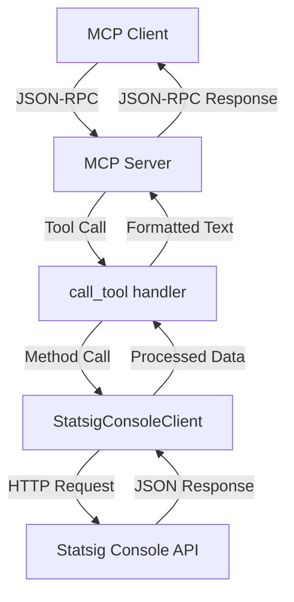

# Statsig MCP Server - Codebase Structure Analysis

**Generated**: Step 2 of Implementation Plan  
**Purpose**: Comprehensive analysis of existing architecture for results functionality extension

## Overview

The Statsig MCP Server is a well-architected Python application that provides Model Context Protocol (MCP) integration for Statsig's Console API. The codebase follows modern Python practices with clean separation of concerns, comprehensive async support, and robust error handling.

## Project Structure

```
statsig-mcp-stats/
├── statsig_mcp/                 # Main package
│   ├── __init__.py              # Package initialization & version
│   ├── __main__.py              # Module entry point 
│   ├── server.py                # MCP server implementation & tool handlers
│   ├── console_client.py        # Statsig Console API client
│   └── types.py                 # Type definitions
├── tests/                       # Test suite
│   ├── __init__.py
│   └── test_server.py
├── examples/                    # Usage examples
│   └── client_example.py
├── docs/                        # Documentation (NEW)
├── pyproject.toml               # Project configuration
├── env.example                  # Environment variables template
├── .gitignore                   # Git ignore rules
├── LICENSE                      # MIT license
├── README.md                    # Main documentation
└── validate.py                  # Validation script
```

## Core Files Analysis

### 1. `statsig_mcp/__init__.py` (7 lines)

**Purpose**: Package initialization and version management

**Contents**:
- Package docstring describing purpose
- Version constant (`__version__ = "1.0.0"`)

**Key Insights**:
- Minimal, clean package initialization
- Version management follows Python standards
- Ready for version bumping in future releases

**Extension Points**: None needed - this file is stable.

---

### 2. `statsig_mcp/__main__.py` (21 lines)

**Purpose**: Module entry point enabling `python -m statsig_mcp` execution

**Architecture**:
```python
# Entry flow:
asyncio.run(main()) → server.main() → MCP server startup
```

**Key Features**:
- Proper async entry point handling
- Comprehensive error handling (KeyboardInterrupt, general exceptions)
- Clean exit codes (0 for normal, 1 for errors)

**Error Handling**:
- `KeyboardInterrupt` → Clean exit (code 0)
- `Exception` → Error message to stderr + exit code 1

**Extension Points**: None needed - this is a simple, stable entry point.

---

### 3. `statsig_mcp/types.py` (22 lines)

**Purpose**: Type definitions and data models

**Current Types**:
```python
class StatsigUserAttributes(TypedDict, total=False):
    user_id: str
    user_email: str | None
    user_country: str | None
    user_ip: str | None
    user_agent: str | None
    app_version: str | None
    locale: str | None
    custom_attributes: dict[str, Any] | None
    private_attributes: dict[str, Any] | None
```

**Extension Opportunities**:
- **Add Results Types**: Need types for experiment results, metrics, pulse data
- **Statistical Types**: Confidence intervals, p-values, effect sizes
- **Export Types**: Format enums, export configurations

**Recommended Additions**:
```python
# New types we'll need:
class ExperimentResult(TypedDict): ...
class MetricData(TypedDict): ...
class PulseReport(TypedDict): ...
class StatisticalSignificance(TypedDict): ...
```

---

### 4. `statsig_mcp/console_client.py` (579 lines)

**Purpose**: Statsig Console API client with comprehensive CRUD operations

**Architecture**:
```python
class StatsigConsoleClient:
    # Initialization & Configuration
    __init__() → initialize() → HTTP client setup
    
    # API Categories (current):
    - Gates (CRUD)
    - Experiments (CRUD) 
    - Dynamic Configs (CRUD)
    - Segments (CRUD)
    - Metrics (Read)
    - Audit Logs (Read)
    - Target Apps (Read)
    - API Keys (Read)
    - Events (Read)
    - Users/Team (Read)
```

**Key Patterns**:
1. **Consistent Error Handling**: All methods use try/catch with logging
2. **Standard Response Format**: `{"success": bool, "data": dict, "error": str}`
3. **Proper HTTP Client**: httpx with timeout, headers, base URL
4. **Async Throughout**: All API calls are async
5. **Initialization Check**: Runtime checks for client initialization

**HTTP Configuration**:
- Base URL: `https://statsigapi.net`
- Headers: `STATSIG-API-KEY`, `STATSIG-API-VERSION`, `Content-Type`
- Timeout: 30 seconds
- Proper cleanup with `aclose()`

**🎯 PERFECT EXTENSION POINT**:
This is where we'll add results functionality:

```python
# New methods to add:
async def get_experiment_results(self, experiment_id: str) -> dict[str, Any]:
async def get_experiment_pulse(self, experiment_id: str) -> dict[str, Any]:
async def get_metric_details(self, metric_id: str, experiment_id: str) -> dict[str, Any]:
async def export_pulse_report(self, experiment_id: str, format: str) -> dict[str, Any]:
```

**Integration Strategy**:
- Follow existing patterns exactly
- Use same error handling approach
- Maintain consistent response format
- Add appropriate logging

---

### 5. `statsig_mcp/server.py` (1,035 lines)

**Purpose**: Main MCP server implementation with tool registration and handling

**Architecture**:
```python
# Global Components
server = Server("statsig-mcp")           # MCP server instance
statsig_client: StatsigConsoleClient    # Global client

# Core Functions
parse_arguments() → get_configuration() → initialize_client() → main()

# MCP Integration
@server.list_tools() → Tool schema definitions
@server.call_tool() → Tool execution routing
```

**Tool Registration Pattern**:
Each tool follows this schema:
```python
{
    "name": "tool_name",
    "description": "Tool description", 
    "inputSchema": {
        "type": "object",
        "properties": { ... },
        "required": [ ... ]
    }
}
```

**Tool Execution Pattern**:
```python
# In call_tool():
elif name == "tool_name":
    param = arguments["param"]
    result = await statsig_client.method(param)
    return [{"type": "text", "text": _format_result(result)}]
```

**Current Tools** (22 total):
- **Gates**: list, get, create, update, delete
- **Experiments**: list, get, create, update, delete  
- **Dynamic Configs**: list, get, create, update, delete
- **Segments**: list, get, create
- **Metrics**: list, get
- **Audit Logs**: list
- **Target Apps**: list, get
- **API Keys**: list
- **Events**: query
- **Users**: get_by_email, list_team

**Response Formatting**:
Consistent helper functions for formatting:
- `_format_list_result()` - For list operations
- `_format_item_result()` - For single items
- `_format_create_result()` - For creation operations
- `_format_update_result()` - For updates
- `_format_delete_result()` - For deletions
- Custom formatters for special cases

**🎯 PERFECT EXTENSION POINT**:
We'll add new tools following the exact same pattern:

```python
# New tools to add in list_tools():
{
    "name": "get_experiment_results",
    "description": "Get comprehensive experiment results with statistical analysis",
    "inputSchema": { ... }
}

# New handlers in call_tool():
elif name == "get_experiment_results":
    experiment_id = arguments["experiment_id"]
    result = await statsig_client.get_experiment_results(experiment_id)
    return [{"type": "text", "text": _format_experiment_results(result)}]
```

## Current API Integration

**Console API Usage**:
- Base URL: `https://statsigapi.net/console/v1/`
- Authentication: `STATSIG-API-KEY` header
- API Version: `20240601`
- All endpoints follow `/console/v1/{resource}` pattern

**HTTP Client Configuration**:
- Library: `httpx.AsyncClient`
- Timeout: 30 seconds
- Proper async context management
- Error handling with status code checks

## Data Flow Architecture



**Key Flow Steps**:
1. **MCP Client** sends tool request via JSON-RPC
2. **MCP Server** routes to appropriate handler in `call_tool()`
3. **Handler** calls corresponding `StatsigConsoleClient` method
4. **Client** makes HTTP request to Statsig Console API
5. **API** returns JSON response
6. **Client** processes and formats response
7. **Handler** formats for display and returns to client

## Error Handling Patterns

**Three-Layer Error Handling**:

1. **Client Level** (`console_client.py`):
   ```python
   try:
       response = await self._client.get(url)
       response.raise_for_status()
       return response.json()
   except Exception as e:
       logger.error(f"Error: {e}")
       return {"error": str(e)}
   ```

2. **Server Level** (`server.py`):
   ```python
   try:
       result = await statsig_client.method()
       return [{"type": "text", "text": format_result(result)}]
   except Exception as e:
       return [{"type": "text", "text": f"Error: {str(e)}"}]
   ```

3. **Application Level** (`__main__.py`, `main()`):
   ```python
   try:
       await server.run(...)
   except Exception as e:
       print(f"Error: {e}", file=sys.stderr)
       sys.exit(1)
   ```

## Configuration Management

**Environment Variables**:
- Primary: `STATSIG_CONSOLE_API_KEY`
- Fallback: Command line `--api-key`
- Validation: Required, error if missing

**Initialization Sequence**:
```python
parse_arguments() → get_configuration() → initialize_client() → server.run()
```

**Client Initialization**:
- Environment variable injection
- HTTP client setup
- Connection validation
- Error handling

## Extension Strategy for Results Functionality

### Integration Points Identified

#### 1. **Type System Extensions** (`types.py`)
**Add new type definitions**:
- `ExperimentResultData`
- `MetricAnalysis` 
- `PulseReportData`
- `StatisticalData`

#### 2. **Client Extensions** (`console_client.py`)
**Add new methods following existing patterns**:
- `get_experiment_results(experiment_id)`
- `get_experiment_pulse(experiment_id)`
- `get_metric_details(metric_id, experiment_id)`
- `export_pulse_report(experiment_id, format)`

#### 3. **Server Extensions** (`server.py`)
**Add new tools following existing patterns**:
- Tool schema definitions in `list_tools()`
- Tool handlers in `call_tool()`
- Response formatters for results data

#### 4. **Response Formatting**
**Add specialized formatters**:
- `_format_experiment_results()` - Statistical data formatting
- `_format_metric_details()` - Metric-specific formatting  
- `_format_pulse_report()` - Report formatting

### Recommended Implementation Approach

**Phase 1: Client Methods**
1. Add results endpoints to `console_client.py`
2. Follow existing error handling patterns
3. Maintain consistent response format

**Phase 2: MCP Tools**
1. Add tool schemas to `list_tools()`
2. Add handlers to `call_tool()`
3. Create specialized formatters

**Phase 3: Type Definitions**
1. Add results-specific types to `types.py`
2. Update client methods to use typed responses
3. Improve type safety

## Development Guidelines

### Code Style Patterns
- **Async/await**: All I/O operations are async
- **Type hints**: Comprehensive typing throughout
- **Error handling**: Try/catch with logging
- **Docstrings**: Clear method documentation
- **Formatting**: Consistent response formatting

### Testing Patterns
- **Validation script**: `validate.py` for integration testing
- **Unit tests**: `tests/test_server.py` 
- **Mock responses**: HTTP client mocking for testing

### Documentation Patterns
- **README.md**: User-facing documentation
- **Docstrings**: Developer documentation
- **Type hints**: Self-documenting code

## Performance Considerations

**Current Performance Features**:
- **Async I/O**: Non-blocking HTTP requests
- **Connection reuse**: Single HTTP client instance
- **Proper cleanup**: Resource management with `aclose()`
- **Timeout handling**: 30-second request timeout

**Opportunities for Enhancement**:
- **Caching**: Add caching layer for frequently accessed data
- **Rate limiting**: Implement request throttling
- **Batch operations**: Group multiple requests
- **Connection pooling**: Optimize HTTP connections

## Security Features

**Current Security Measures**:
- **API Key Protection**: Environment variable only
- **HTTPS Only**: Secure transport to Statsig
- **Input Validation**: MCP schema validation
- **Error Information**: No sensitive data in error messages

**Security Considerations for Extensions**:
- **Results Data**: May contain sensitive business metrics
- **Caching**: Secure cache storage if implemented
- **Logging**: Avoid logging sensitive data

## Summary

The Statsig MCP Server codebase is exceptionally well-designed for extension:

### ✅ **Strengths**
- **Clean Architecture**: Clear separation of concerns
- **Consistent Patterns**: Predictable code structure throughout
- **Comprehensive Error Handling**: Robust error management
- **Modern Python**: Async, type hints, best practices
- **Extensible Design**: Easy to add new functionality

### 🎯 **Perfect Extension Points**
- **`console_client.py`**: Add results API methods
- **`server.py`**: Add new MCP tools
- **`types.py`**: Add results type definitions

### 📋 **Implementation Path**
1. **Follow existing patterns exactly** - don't reinvent
2. **Maintain consistency** with current code style
3. **Use same error handling** approach throughout
4. **Add comprehensive testing** for new functionality

The codebase is production-ready and follows industry best practices. Our results functionality extensions will integrate seamlessly using the established patterns.
